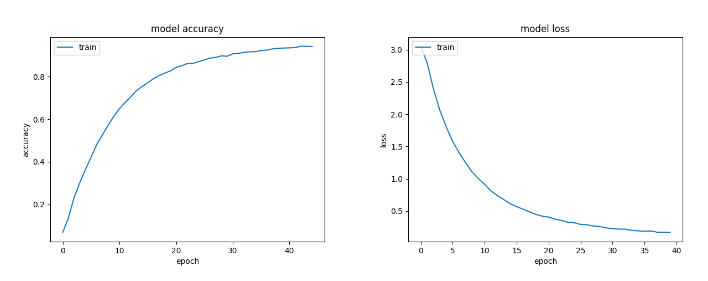

# *TÜRK İŞARET DİLİ ALFABESİ TANIMA*

Bu proje, Türk İşaret Dili alfabesini tanımak için bir evrişimli sinir ağı (CNN) modeli kullanılarak geliştirilmiştir. Proje, işaret dilini tanıyarak alfabedeki harfleri doğru bir şekilde sınıflandırmayı amaçlamaktadır.

## *Proje Hakkında*

Türk İşaret Dili, işitme engelli bireylerin iletişim kurabilmesi için önemli bir araçtır. Bu projede, el hareketlerini ve pozisyonlarını tanıyarak bu hareketleri Türk İşaret Dili alfabesindeki harflere dönüştüren bir sistem geliştirilmiştir.

## *Kullanılan Teknolojiler*

- **Python**: Projenin ana programlama dili.
- **TensorFlow ve Keras**: Derin öğrenme modeli oluşturmak için kullanılan kütüphaneler.
- **OpenCV**: Görüntü işleme ve el hareketlerini algılama için kullanılmıştır.
- **NumPy**: Veri manipülasyonu ve matematiksel işlemler için.
- **Matplotlib**: Veri görselleştirme için.

## *Veri Seti*

Bu proje için kullanılan veri kümesi, farklı el hareketleri ve pozisyonları içeren görüntülerden oluşmaktadır. Veri kümesi, her harf için yeterli sayıda örnek içerir ve modelin eğitimi için kullanılmıştır. Veri seti içerisinde dinamik görüntülerden oluşan harfler (ç, ğ, i, j, ö, ş, ü) bulunmamaktadır. 22 harf kullanılarak model eğitilmiştir.

Veri Seti: [TİD-Veri-Seti](https://www.kaggle.com/datasets/berkaykocaoglu/tr-sign-language/data?select=tr_signLanguage_dataset)

## *Model Eğitimi*
Evrişimli Sinir Ağı (CNN) kullanılarak model eğitilmiştir. Model, çeşitli katmanlar içeren bir CNN mimarisi ile oluşturulmuştur:

- **Giriş Katmanı**: Giriş görüntülerini alır.
- **Evrişim Katmanları**: Görüntüden özellikleri çıkarır.
- **Havuzlama Katmanları**: Özellik haritalarını boyutunu küçültür.
- **Tam Bağlantılı Katmanlar**: Sınıflandırma işlemini gerçekleştirir.
- **Çıkış Katmanı**: 22 sınıfa (A-Z harfleri) sınıflandırma yapar.

### *Model Mimarisinin Detayları*


## *Projenin Çalıştırılması*
1. Gerekli kütüphaneleri yükleyin:

   ```bash
   pip install tensorflow opencv-python numpy matplotlib 

2. Veri kümesini indirin ve data/ dizinine yerleştirin.

3. Modeli eğitmek için aşağıdaki komutu çalıştırın:
   ```bash
      python Train.py
     ``` 
5. Eğitilmiş modeli kullanarak tahmin yapmak için:
   ```bash
      python Predict.py
     ```

## *Sonuçlar*
Model, %96.84 doğruluk oranına ulaşmıştır. Eğitim ve doğrulama süreci boyunca elde edilen sonuçlar aşağıdaki grafikte gösterilmektedir.




## *Katkıda Bulunma* 

Projeye katkıda bulunmak isterseniz, lütfen bir çekme isteği (pull request) gönderin. Her türlü katkı ve öneriye açığız.

## *İletişim*

Proje hakkında herhangi bir sorunuz veya öneriniz varsa, lütfen bana e-posta ile ulaşın: elifftasdemirr@gmail.com
